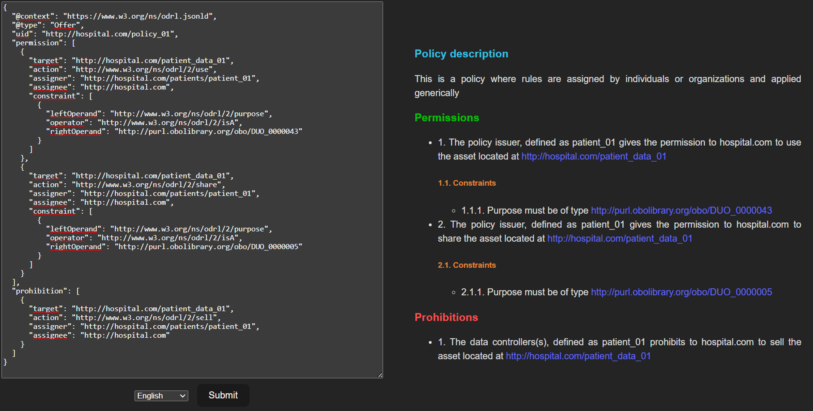
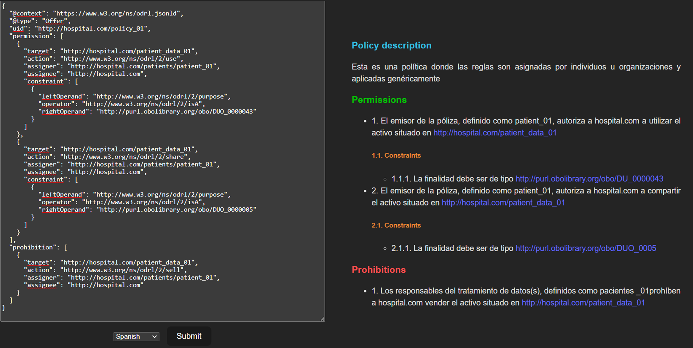

# Prerequisites

- Node.js v16.0.0 or higher
- PNPM or NPM or Yarn

# How to use

- The ODRL translator is located at http://localhost:3000 (or http://127.0.0.1:3000).
- The ODRL Builder and Translator interfaces are located at http://localhost:5173 (or http://127.0.0.1:5173).

1. Go to the server folder and run the following commands:

```sh
pnpm install

# after installation, run:

pnpm run dev
```

2. Go to the frontend folder and run the following commands:

```sh
pnpm install

# after installation, run:

pnpm run dev
```

3. Now, you can visit http://127.0.0.1:5173/ and test the translator and/or builder.

You can also use Docker to run run the server and the web interface in one go:

```sh
docker-compose up --build
```

# TODO

- [ ] Support for logical constraint translation.
- [ ] Ability to parse custom profiles.
- [ ] Support for multiple inputs (for example, a logical constraint is referenced by its URI in another graph).
